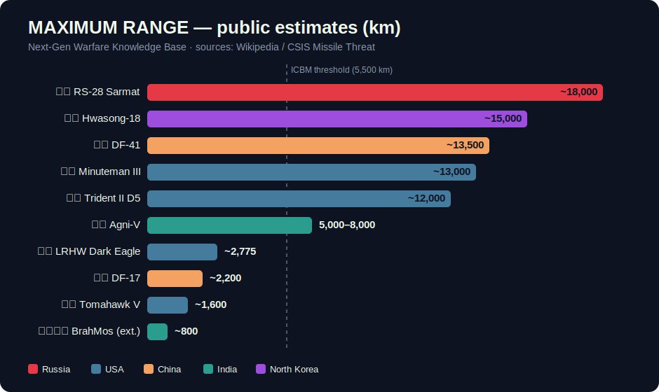

# Class: Ballistic Missiles

**Flight profile:** a rocket booster lofts the payload on a high arc — often into space — after which the warhead(s) fall back to the target under gravity, hitting re-entry speeds of Mach 20+.

## Sub-types

| Sub-type | Range | Example |
|---|---|---|
| SRBM (short-range) | < 1,000 km | Iskander-M |
| MRBM/IRBM (medium/intermediate) | 1,000–5,500 km | [DF-17](../inventory/df-17.md) booster, [Agni-V](../inventory/agni-v.md) (upper edge) |
| **ICBM** (intercontinental) | > 5,500 km | [RS-28 Sarmat](../inventory/rs-28-sarmat.md), [DF-41](../inventory/df-41.md), [Minuteman III](../inventory/minuteman-iii.md), [Hwasong-18](../inventory/hwasong-18.md) |
| **SLBM** (submarine-launched) | varies | [Trident II D5](../inventory/trident-ii-d5.md) |

## Key concepts

- **MIRV** — one missile, many warheads, each steered to a different target. Multiplies firepower and overwhelms defenses.
- **Solid vs. liquid fuel** — solid-fuel missiles launch in minutes with no fueling signature (see [Hwasong-18](../inventory/hwasong-18.md)'s significance); liquid fuel offers more throw-weight ([Sarmat](../inventory/rs-28-sarmat.md)).
- **Basing = survivability** — silos are hardened but fixed; road-mobile launchers ([DF-41](../inventory/df-41.md)) hide; submarines ([Trident](../inventory/trident-ii-d5.md)) hide best of all.

## Strengths & weaknesses

✅ Unmatched range and speed; very hard to intercept in midcourse at scale
❌ Predictable arc once tracked (this is exactly what [hypersonic glide vehicles](hypersonic-weapons.md) were invented to fix); silo launch points are known

## Countered by
Midcourse and terminal interceptors — see [Air Defense & Interceptors](air-defense-interceptors.md).
