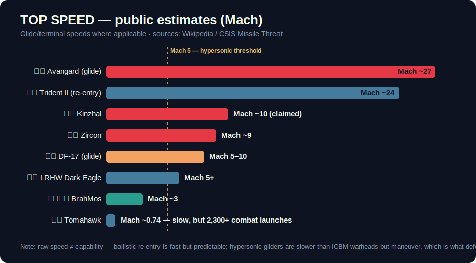

# Class: Hypersonic Weapons

**Definition:** weapons that sustain **Mach 5+** *and maneuver* inside the atmosphere. Pure speed isn't the point — every ICBM re-enters faster. The revolution is speed **plus** an unpredictable, low-altitude flight path.

## The two real types (and one marketing type)

| Type | How it flies | Examples |
|---|---|---|
| **HGV** — boost-glide | Ballistic booster lofts a wedge-shaped glider that skips/steers through the upper atmosphere | [Avangard](../inventory/avangard.md), [DF-17](../inventory/df-17.md), [LRHW Dark Eagle](../inventory/lrhw-dark-eagle.md) |
| **HCM** — hypersonic cruise | Scramjet engine breathes air and sustains Mach 5+ the whole way | [Zircon](../inventory/zircon.md) |
| *Quasi-ballistic (often marketed as hypersonic)* | Air-launched ballistic missile that maneuvers moderately | [Kinzhal](../inventory/kinzhal.md) |

## Why defenders struggle

1. **The altitude gap** — HGVs fly ~20–60 km up: *above* air-defense systems, *below* ballistic-missile-defense radar coverage optimized for space.
2. **No predictable arc** — mid-flight maneuvering defeats the intercept-point math that ballistic defense relies on.
3. **Compressed timeline** — over-the-horizon detection to impact can be under a minute at sea (see [Zircon](../inventory/zircon.md)).

## Reality check
Ukraine's Patriot batteries have intercepted [Kinzhal](../inventory/kinzhal.md) — a reminder that "hypersonic" is a spectrum, and quasi-ballistic weapons remain interceptable. True HGVs in glide remain the unsolved case; counter-hypersonic interceptors (e.g., the US Glide Phase Interceptor program) are still in development.

## See also
[Ballistic Missiles](ballistic-missiles.md) · [Air Defense & Interceptors](air-defense-interceptors.md)
