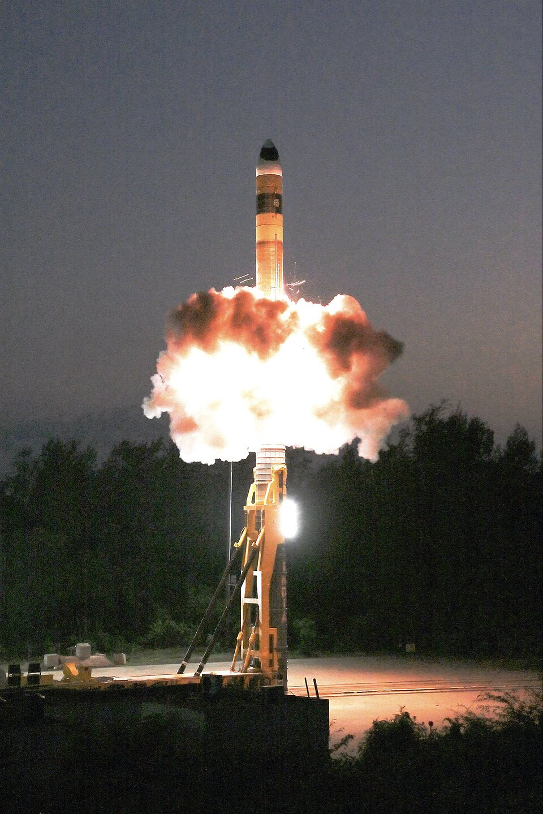

# Agni-V (अग्नि-५, "Fire")

| Quick facts | |
|---|---|
| **Origin** | 🇮🇳 India (DRDO) |
| **Class** | Road/rail-mobile [ICBM-class ballistic missile](../classes/ballistic-missiles.md), solid-fuel, canisterized |
| **Range** | 5,000–8,000 km (official 5,000+; independent estimates higher) |
| **Speed** | ~Mach 24 terminal |
| **Payload** | Nuclear; **MIRV-capable** (Mission Divyastra test, March 2024) |
| **Status** | In service with India's Strategic Forces Command |

## Overview
Agni-V is the longest-range missile India has fielded and the system that carried India into the MIRV club: the March 2024 "Mission Divyastra" test demonstrated multiple independently targetable warheads. Canisterized launch means the missile is stored sealed and mated, cutting launch preparation to minutes and improving survivability on the move. Its range comfortably covers all of Asia and reaches into Europe.

## Why it matters
- **India's MIRV milestone** — only a handful of nations have demonstrated the capability.
- **Credible minimum deterrence, extended:** brings all of China within range from deep inside India.
- **Stepping stone:** the Agni-VI, with true intercontinental range and heavier MIRV load, is reportedly in development.

## See also
- Class: [Ballistic Missiles](../classes/ballistic-missiles.md) · Armory: [India](../armory/india.md)
- Compare: [DF-41](df-41.md), [Hwasong-18](hwasong-18.md)

## Sources
- [Wikipedia — Agni-V](https://en.wikipedia.org/wiki/Agni-V)
- [CSIS Missile Threat — Agni-V](https://missilethreat.csis.org/missile/agni-5/)
