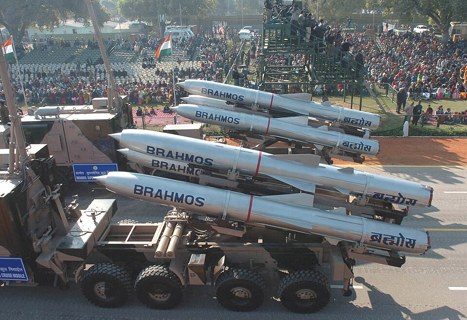

# BrahMos (PJ-10)

| Quick facts | |
|---|---|
| **Origin** | 🇮🇳 India / 🇷🇺 Russia joint venture (BrahMos Aerospace; named for the Brahmaputra + Moskva rivers) |
| **Class** | Supersonic [cruise missile](../classes/cruise-missiles.md) / [anti-ship](../classes/anti-ship-missiles.md), multi-platform |
| **Range** | ~290 km (export) up to ~800 km (extended versions) |
| **Speed** | ~Mach 2.8–3.0 |
| **Payload** | 200–300 kg conventional |
| **Status** | In service on land, ships, submarines, and Su-30MKI aircraft; exported (Philippines, 2024) |

## Overview
Derived from Russia's P-800 Oniks, BrahMos is the fastest cruise missile in wide operational service. It sea-skims at nearly three times the speed of sound, giving a target ship a fraction of the reaction time a subsonic missile would allow, and its kinetic energy alone adds enormous destructive effect. Its true signature capability is versatility: the same missile family launches from coastal batteries, destroyers, submarines, and fighter jets. A hypersonic successor, **BrahMos-II**, is in development.

## Why it matters
- **Speed in service today:** Mach 3 attack capability that is fielded and exported *now*, not in testing.
- **Every launch platform:** the most genuinely multi-platform heavy cruise missile anywhere.
- **Geopolitical weight:** its export to the Philippines made it a factor in South China Sea deterrence.

## See also
- Class: [Cruise Missiles](../classes/cruise-missiles.md), [Anti-Ship Missiles](../classes/anti-ship-missiles.md) · Armory: [India](../armory/india.md)
- Compare: [Zircon](zircon.md), [Tomahawk](tomahawk.md)

## Sources
- [Wikipedia — BrahMos](https://en.wikipedia.org/wiki/BrahMos)
- [CSIS Missile Threat — BrahMos](https://missilethreat.csis.org/missile/brahmos/)
