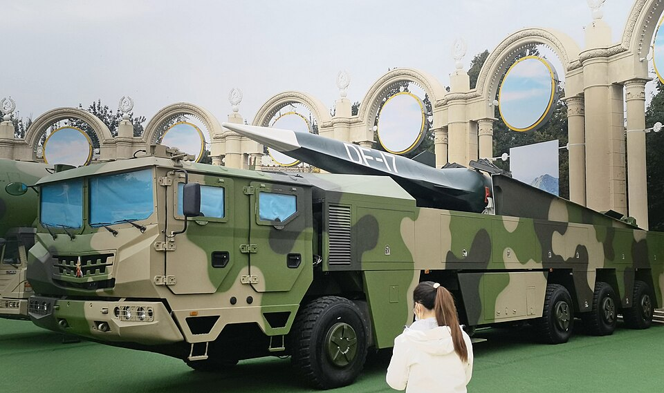

# DF-17 (Dongfeng-17, 东风-17)

| Quick facts | |
|---|---|
| **Origin** | 🇨🇳 China (CASC) |
| **Class** | Medium-range ballistic missile carrying the **DF-ZF** [hypersonic glide vehicle](../classes/hypersonic-weapons.md) |
| **Range** | ~1,800–2,500 km |
| **Speed** | ~Mach 5–10 in glide |
| **Status** | In service (paraded 2019); considered the first HGV system fielded at scale |

## Overview
The DF-17 pairs a ballistic booster with the DF-ZF glide vehicle. After boost, the flat, wedge-shaped glider skips and maneuvers through the atmosphere at hypersonic speed on a flattened, unpredictable trajectory — below the view of many ballistic-missile-defense radars but far above and faster than what air-defense systems were built for. It is widely read as a theater-range weapon aimed at high-value regional targets such as air bases and carrier groups' supporting infrastructure.

## Why it matters
- **First mass-fielded HGV system** — visible in numbers at parades, not just test ranges.
- **The "gap" weapon:** flies in the altitude band between air-defense and missile-defense coverage.
- **Regional game-changer:** puts US and allied bases in the Western Pacific under a new class of threat.

## See also
- Class: [Hypersonic Weapons](../classes/hypersonic-weapons.md) · Armory: [China](../armory/china.md)
- Compare: [Avangard](avangard.md), [LRHW Dark Eagle](lrhw-dark-eagle.md)

## Sources
- [Wikipedia — DF-17](https://en.wikipedia.org/wiki/DF-17)
- [CSIS Missile Threat — DF-17](https://missilethreat.csis.org/missile/df-17/)
