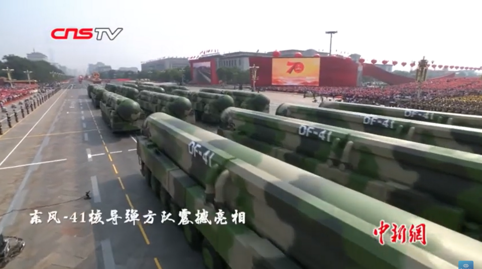

# DF-41 (Dongfeng-41, 东风-41 / NATO: CSS-20)

| Quick facts | |
|---|---|
| **Origin** | 🇨🇳 China (CASC) |
| **Class** | Road-mobile [ICBM](../classes/ballistic-missiles.md), solid-fuel |
| **Range** | ~12,000–15,000 km |
| **Speed** | ~Mach 25 terminal (typical ICBM re-entry) |
| **Payload** | MIRV — up to 10 warheads (reported) |
| **Status** | In service; publicly revealed at 2019 National Day parade |

## Overview
The DF-41 is China's most capable ICBM: a three-stage, solid-fuel missile carried on a 16-wheel transporter-erector-launcher (TEL). Solid fuel means it can launch within minutes rather than hours, and road mobility means it has no fixed address — the combination that makes mobile ICBMs the hardest leg of an arsenal to preempt. Rail-mobile and silo-based variants have also been reported, alongside China's large new silo fields in its western deserts.

## Why it matters
- **Reach:** from central China it can range virtually the entire continental United States.
- **Survivability:** shoot-and-scoot mobility plus solid fuel = very hard to find and destroy before launch.
- **Arsenal growth signal:** centerpiece of China's rapid strategic expansion in the 2020s.

## See also
- Class: [Ballistic Missiles](../classes/ballistic-missiles.md) · Armory: [China](../armory/china.md)
- Compare: [RS-28 Sarmat](rs-28-sarmat.md), [Minuteman III](minuteman-iii.md), [Hwasong-18](hwasong-18.md)

## Sources
- [Wikipedia — DF-41](https://en.wikipedia.org/wiki/DF-41)
- [CSIS Missile Threat — DF-41](https://missilethreat.csis.org/missile/df-41/)
