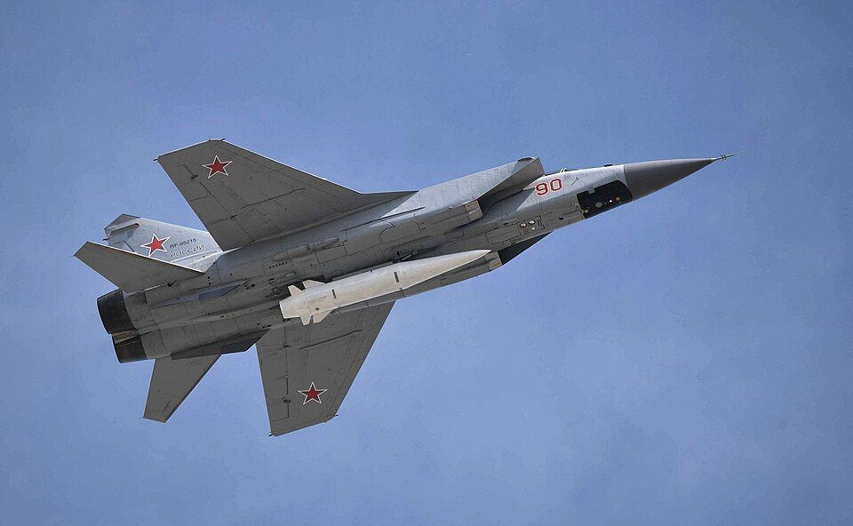

# Kh-47M2 Kinzhal («Кинжал», "Dagger")

| Quick facts | |
|---|---|
| **Origin** | 🇷🇺 Russia |
| **Class** | Air-launched ballistic missile (ALBM), often marketed as [hypersonic](../classes/hypersonic-weapons.md) |
| **Range** | ~1,500–2,000 km (including carrier aircraft radius) |
| **Speed** | Up to ~Mach 10 (claimed) |
| **Carrier** | MiG-31K interceptor, Tu-22M3 bomber |
| **Payload** | Conventional or nuclear |
| **Status** | In service since 2017; used in combat in Ukraine (first combat use of a "hypersonic" weapon) |

## Overview
Kinzhal is essentially an air-launched adaptation of the Iskander short-range ballistic missile. Carried to altitude and speed by a MiG-31K, it gains substantial range and energy compared with a ground launch, and can maneuver during flight. Its combat debut in Ukraine in 2022 made it the first weapon marketed as hypersonic to be used in war — though Patriot PAC-3 batteries have reportedly intercepted several, fueling debate about how "uninterceptable" quasi-ballistic weapons really are.

## Why it matters
- **First combat-used "hypersonic" weapon** in history.
- **Aircraft as first stage:** shows how pairing a ballistic missile with a fast, high-flying jet stretches range and complicates warning.
- **Reality-check case study:** its interceptions in Ukraine sharpened the distinction between true hypersonic glide/cruise weapons and fast quasi-ballistic missiles.

## See also
- Class: [Hypersonic Weapons](../classes/hypersonic-weapons.md), [Ballistic Missiles](../classes/ballistic-missiles.md) · Armory: [Russia](../armory/russia.md)
- Counter: [Air Defense & Interceptors](../classes/air-defense-interceptors.md)

## Sources
- [Wikipedia — Kh-47M2 Kinzhal](https://en.wikipedia.org/wiki/Kh-47M2_Kinzhal)
- [CSIS Missile Threat — Kinzhal](https://missilethreat.csis.org/missile/kinzhal/)
