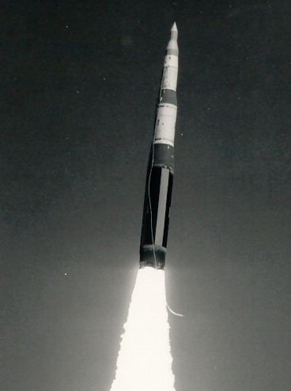

# LGM-30G Minuteman III

| Quick facts | |
|---|---|
| **Origin** | 🇺🇸 United States (Boeing) |
| **Class** | Silo-based [ICBM](../classes/ballistic-missiles.md), solid-fuel |
| **Range** | ~13,000 km |
| **Speed** | ~Mach 23 terminal |
| **Payload** | 1–3 warheads (currently single W87 under New START) |
| **Status** | In service since **1970**; ~400 on alert; to be replaced by LGM-35A Sentinel |

## Overview
The Minuteman III is the veteran of this knowledge base: the only land-based ICBM the United States fields, on continuous alert for over five decades across silo fields in Montana, North Dakota, and Wyoming. It was the world's first MIRVed ICBM when introduced. Kept current through repeated guidance and propulsion life-extension programs, it is scheduled for replacement by the LGM-35A Sentinel in the 2030s.

## Why it matters
- **Longest-serving ICBM in history** — a masterclass in sustaining strategic hardware.
- **First with MIRV:** introduced the multiple-warhead architecture every heavy ICBM now uses.
- **One leg of the triad:** anchors the US land-based deterrent alongside [Trident II](trident-ii-d5.md) at sea and bombers in the air.

## See also
- Class: [Ballistic Missiles](../classes/ballistic-missiles.md) · Armory: [United States](../armory/united-states.md)
- Compare: [RS-28 Sarmat](rs-28-sarmat.md), [DF-41](df-41.md)

## Sources
- [Wikipedia — LGM-30 Minuteman](https://en.wikipedia.org/wiki/LGM-30_Minuteman)
- [CSIS Missile Threat — Minuteman III](https://missilethreat.csis.org/missile/minuteman-iii/)
