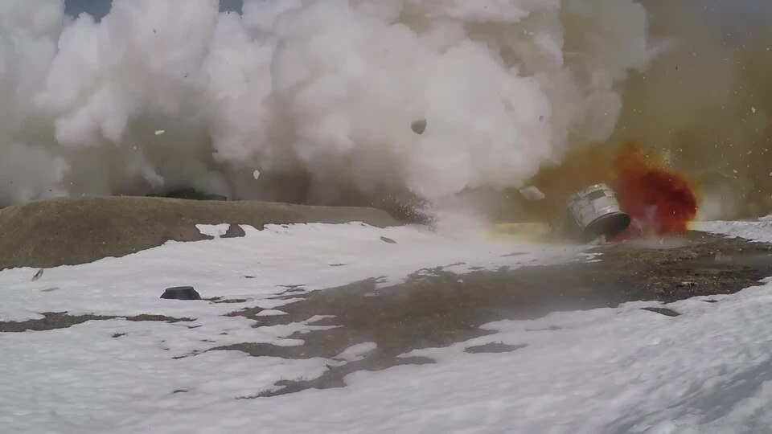

# RS-28 Sarmat («Сармат» / NATO: SS-X-29/30 "Satan II")

| Quick facts | |
|---|---|
| **Origin** | 🇷🇺 Russia (Makeyev Rocket Design Bureau) |
| **Class** | Silo-based heavy [ICBM](../classes/ballistic-missiles.md) |
| **Range** | ~18,000 km (claimed) |
| **Speed** | Hypersonic on re-entry (Mach 20+ terminal) |
| **Payload** | Up to ~10 tonnes; MIRV — up to 10+ warheads or [Avangard](avangard.md) glide vehicles |
| **Length / Weight** | ~35.3 m / ~208 tonnes |
| **Status** | Entered combat duty (announced 2023); troubled test record |
| **Replaces** | R-36M2 Voevoda ("Satan") |

## Overview
The Sarmat is the heaviest intercontinental ballistic missile in the world. It is a liquid-fueled, silo-launched system designed to replace the Soviet-era R-36M2. Its enormous throw-weight lets it carry a large MIRV bus (multiple independently targetable warheads) or several Avangard hypersonic glide vehicles, and Russia claims it can fly suppressed or even south-polar trajectories to avoid early-warning radars and missile defenses.

## Why it matters
- **Raw scale:** largest payload capacity of any ICBM in service.
- **Defense evasion by design:** short boost phase and unconventional trajectories are explicitly aimed at complicating interception.
- **Symbolic weight:** heavily featured in Russian strategic messaging since 2018.

## See also
- Class: [Ballistic Missiles](../classes/ballistic-missiles.md) · Armory: [Russia](../armory/russia.md)
- Compare: [DF-41](df-41.md), [Minuteman III](minuteman-iii.md)

## Sources
- [Wikipedia — RS-28 Sarmat](https://en.wikipedia.org/wiki/RS-28_Sarmat)
- [CSIS Missile Threat — RS-28 Sarmat](https://missilethreat.csis.org/missile/rs-28-sarmat/)
