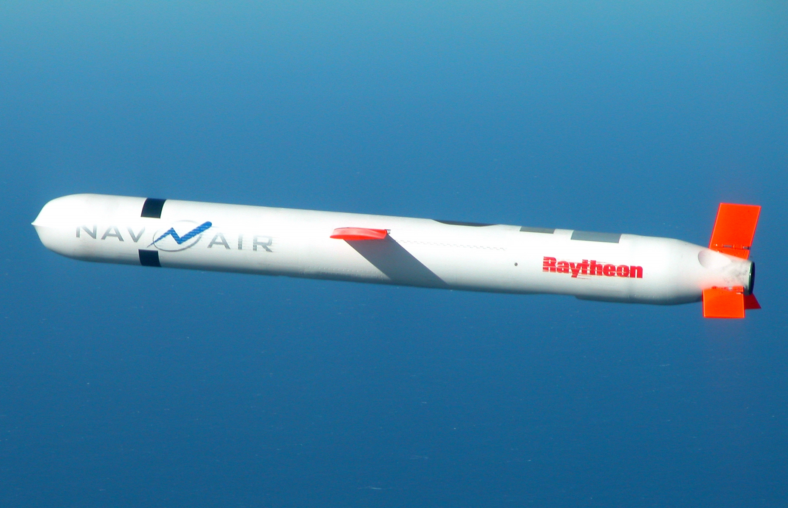

# BGM-109 Tomahawk (Block V)

| Quick facts | |
|---|---|
| **Origin** | 🇺🇸 United States (Raytheon) |
| **Class** | Subsonic [cruise missile](../classes/cruise-missiles.md), ship/submarine-launched |
| **Range** | ~1,600 km (Block V) |
| **Speed** | ~880 km/h (high subsonic) |
| **Payload** | 450 kg conventional unitary warhead |
| **Status** | In service since 1983; 2,300+ combat firings; Block V rolling out with anti-ship (Va) and enhanced-warhead (Vb) variants |

## Overview
The Tomahawk is the most combat-proven missile on Earth. It wins no races — it flies below the speed of an airliner — but it wins wars of attrition against air defenses by flying extremely low, navigating by terrain contour and GPS, threading around radar coverage, and arriving within meters of its aim point after a 1,000+ km trip. The current Block V adds in-flight retargeting via satellite link and a Maritime Strike variant that can hit moving ships.

## Why it matters
- **The combat record:** more real-world strikes than every other missile in this wiki combined.
- **Proof that slow can win:** demonstrates route-planning and terrain-masking as an alternative to raw speed.
- **Massed and networked:** fired in salvos from many platforms at once, saturating defenses by volume.

## See also
- Class: [Cruise Missiles](../classes/cruise-missiles.md) · Armory: [United States](../armory/united-states.md)
- Compare: [Kalibr (see Russia armory)](../armory/russia.md), [Storm Shadow (see Europe armory)](../armory/europe.md)

## Sources
- [Wikipedia — Tomahawk (missile)](https://en.wikipedia.org/wiki/Tomahawk_(missile))
- [CSIS Missile Threat — Tomahawk](https://missilethreat.csis.org/missile/tomahawk/)
