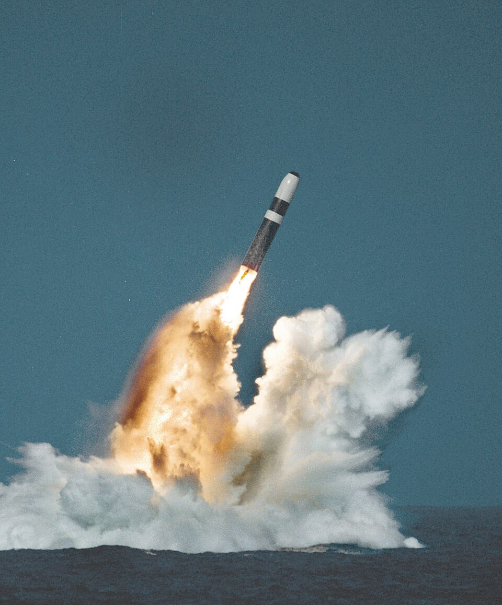

# UGM-133 Trident II (D5)

| Quick facts | |
|---|---|
| **Origin** | 🇺🇸 United States (Lockheed Martin) — also arms the 🇬🇧 Royal Navy |
| **Class** | Submarine-launched ballistic missile ([SLBM](../classes/ballistic-missiles.md)) |
| **Range** | ~12,000 km (payload-dependent) |
| **Speed** | ~Mach 24 terminal |
| **Payload** | MIRV — up to 8–12 warheads (treaty-limited in practice) |
| **Status** | In service since 1990 aboard *Ohio*-class (US) and *Vanguard*-class (UK) submarines; life-extended (D5LE) into the 2040s |

## Overview
Trident II is the most accurate sea-launched ballistic missile ever fielded — accurate enough to hold hardened targets at risk, a capability once reserved for land-based ICBMs. Launched from a submerged submarine that can hide anywhere in the world's oceans, it combines near-ICBM range with the survivability that makes the sea leg the backbone of both American and British deterrence. Its test record — over 190 consecutive successful launches — is unmatched in the class.

## Why it matters
- **Survivability + precision** in one system: nothing else combines a hidden launch platform with hard-target accuracy.
- **Two nations' deterrent:** the entire UK nuclear force rides on this one missile type.
- **Reliability benchmark:** the longest unbroken success streak of any strategic missile.

## See also
- Class: [Ballistic Missiles](../classes/ballistic-missiles.md) · Armory: [United States](../armory/united-states.md)
- Compare: [RS-28 Sarmat](rs-28-sarmat.md), [Hwasong-18](hwasong-18.md)

## Sources
- [Wikipedia — UGM-133 Trident II](https://en.wikipedia.org/wiki/UGM-133_Trident_II)
- [CSIS Missile Threat — Trident D-5](https://missilethreat.csis.org/missile/trident/)
